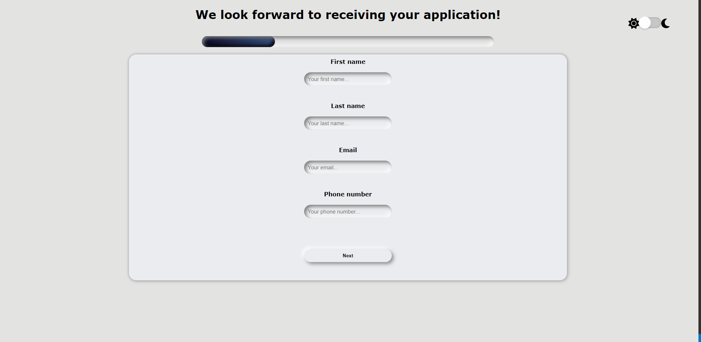

# Neumorphism form

## Overview 🔍



### Neumoporphism?

Neumorphic design is a visual trend that has gained traction with UI/UX designers and become a popular aesthetic choice for contemporary software, websites, and mobile apps. To read more about check this acticle: https://hype4.academy/articles/design/neumorphism-in-user-interfaces. Also here you can check simply generator for UI css code: https://neumorphism.io/#e0e0e0

### Project assumption:
The main goal of this project was to practice and improve skills building app with styled-components solution. It's a React-specific CSS-in-JS styling solution that creates a platform for developers to write actual CSS code to style React components.

### Features:

- **Neumorphic design**
- **Progression is visualised by a progress bar**
- **Validation at every step of the form**
- **Easily moving through steps, without losing entries**
- **At the last stage, we have a summary page where you can check all your entries**
   - **The form is generated from the array in /Helpers/formSettings. There you can see all the fields with specific patterns, errors, or names. This solution allows me to add some other fields if i wish without interrupting to deep js code**


## Built with 🔧


## Installation and configuration 💾

The project uses [node](https://nodejs.org/en/) and [npm](https://www.npmjs.com/), follow the steps below to be able to use the application.

- Install all npm packages using command:
````
npm i
````

- To start develope mode use command:

````
npm start
````


## Author 🔥
* Linkedin - [AndrejKaczanowski](https://www.linkedin.com/in/andrej-kaczanowski-frontend/).

## Special thanks 🙏🏻
Thanks to my [Mentor - devmentor.pl](https://devmentor.pl/) - for providing me with this task and for code review.
